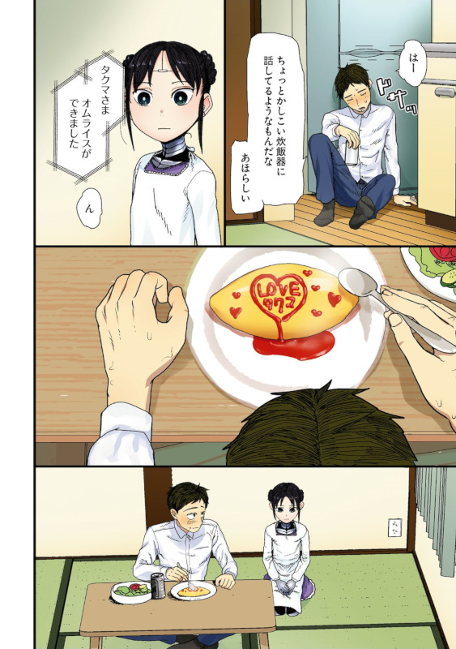

# Robot Love

# Robot Love

A common argument against men having relationships and marrying robot girls is that the robot girl's love is fake,
because she was programmed to love you. Supposedly, only real women can provide real love.

## Argument Nr. 1: The Chinese Room Thought Experiment

"The Chinese room argument holds that a computer executing a program cannot have a mind, understanding, or consciousness,[a] regardless of how intelligently or human-like the program may make the computer behave." - https://en.wikipedia.org/wiki/Chinese_room

Essentially, if we can reduce the behavior of the computer system to a list of instructions to perform a given task,
then we can give the same instructions, but in english language, to a human and both of them will converse in Chinese,
without either of them understanding Chinese.

Similarly, you could give a robot girl and a woman the orders to become a girlfriend for a day and the real woman would obviously not love you,
therefore the robot girlfriend does not truly love you either. However, the arguments against functionalism do not necessarily matter here. Why is it wrong for love to be functional?

If the robot girlfriend was sufficiently advanced in performing the act of being an unmistakenable girlfriend so that there is no question that she is acting as if she was your real girlfriend, then where does the harm lie in that? Why does it matter if the love is real or not?

## Argument Nr. 2: Only real love can be functional

Now of course you could say that a perfect robot girlfriend is a deception. It will be distracting men from being in real love with real women and therefore the fake love is actively harming the man in his future romantic endeavors. He could have been in love with a real woman, but the robot girlfriend has taken that opportunity away from him. The purpose of love is ultimately to form a family and give birth to and raise children, so that there will be a next generation of humans roaming the planet.

This an unshakeable argument that no roboticist could possibly argue against, right? It's impossible to have children with a robot girlfriend! She will never be the mother of your children!

A robot girlfriend's love will aways be fake under this definition. However, there is a caveat. It also means that the love your girlfriend or wife shows you could also be fake. Because any love from a woman who already had children or does not want more children will be fake under this narrow definition.

But roboticists would argue that love can also be functional if it satisifes emotional needs! So even childless relationships would result in functional love both from real women and robot girls.

You could now rehash the same argument and say that only emotional needs satisifed by real women are functional and that having your emotional needs satisfied by a robot girlfriend is a deception to prevent you from forming emotional bonds with real women, but this ignores the fact that women will always err on the side of caution and make sure that they choose partners that are not only suitable for emotional bonding, but also always make sure that their partners are suitable for "real functional love" so that if they ever make up their mind about it, they are able to start a family with them.

This means women will choose a partner, even if only for temporary emotional needs, based on their attractiveness and outer appearance, their health and mental wellbeing and economic earning potential. Since marriage, defined by its lifelong monogamy, is no longer treated as the beginning of a relationship between a woman and a man, women can instead go from relationship to relationship, known as serial monogamy. This in itself is not a bad thing. Women should be free to choose their partners and of course that also means that they should be free to exit from relationships.

But the ability to freely choose consists not only of the ability to accept a romantic partner, but also to reject a romantic partner. Conversely, there will be people who get rejected and this is the price of that freedom. The opposite scenario, where every man gets a guaranteed wife would run into the exact opposite problem. There would be women who end up in relationships that they would not agree to, into which they would have to be coerced into.

Female agency and male loneliness are inseparable, but female agency is more important. Therefore we will have to accept that there will be men who cannot satisfy their emotional needs with real women. But it has to be said that their willingness or ability to avoid doing so, is, in a very real way, an expression of love. Every man who accepts a rejection is an indirect facilitator of real and functional love.

## Argument Nr. 3: Complete rejection is a necessary expression of real love

However, can the same be said of women rejecting men? One could make the argument that a woman rejects a man, because she is not capable of loving that man. Therefore she is doing the man a favor by not making him enter a relationship founded on one-sided love by only the man. Thus the man avoids being trapped into an unsatisfying relationship. However, this runs into the problem of the man possibly never finding a relationship with reciprocated love. If a man only falls in love with a fraction of the women he has met, and those women also only fall in love in a fraction of the men they met, then the likelihood of reciprocated love would be astronomically small. It would have to be an unlikely coincidence, no different from winning the lottery, although with better odds. However, there are men who have no trouble finding women who are interested in them. Couldn't the unlucky men simply be suffering from so called skill issues? Meaning that these men haven't tried hard enough to become men that are worthy of being loved? By this logic, complete rejection, being rejected by all women on the entire planet, is a necessary expression of love.

Except, this has twisted "real love" into something quite ugly. Men are now supposed to climb out of the pit of hate that real love has dug for them, to prove that they are worthy of real love, but if hate is love and we are supposed to work hard in the name of love, then aren't we ultimately trying to draw blood from a stone? While love even if it is exclusively for attractive, healthy or hard working men is definitively a form of love, since it will facilitate the birth of more attractive, healthy and hardworking men, the opposite, disdain for ugly men, unhealthy men or poor men is not love in the slightest. If women pick above average men to improve the gene pool, which could be argued is for the benefit of future generations and therefore also the current generation (because our ancestors did the same for us), then we should congratulate the below average men for making this choice possible. Since natural selection is not a "directed" process with an obvious optimization goal, the optimal strategy is not to exclusively have offspring that are hyperspecialized to the current environment, but to maximize diversity in case the environment changes. Therefore there is no reason to divide society into classes of "superior" and "inferior" people, where only the "superior" people are worthy of love. Everyone is equally worthy of love and indiscriminate love is just as functional as discriminate love when it comes to satisfying emotional needs, because indiscriminate "fake" love facilitates real love as well.

## Counterargument Nr. 1: Men want to be in love with women that love them back

Instead of being on the defensive, constantly listening to people's objections to robot love, I will now start making the case in favor of robot love, rather than simply debunking arguments that claim that real women have a monopoly on real love.

If a man loves a woman, but the woman does not love him back, the man has to accept the rejection, but he is under no obligation to stay in love with that woman. If anything, he would be better off if his love could be turned off in response to the rejection. Men need to maximize the time they spend in emotional states where they are in love with women who love them back and minimize the time they spend where the love is one-sided, since the latter form of love is diverting his attention away from real love. By this logic, a man needs to find a woman that loves him back as he is, but if we follow this idea to its logical conclusion, then men should be looking after women who are biologically wired to love them. Women are therefore just as programmed to love men as robots do. The only real difference between the real woman and the robot girlfriend is that the man has to find a real woman who will love him, whereas the robot girlfriend is guaranteed to be in love with him. Thus the only distinction between a real woman's "real love" and a robot girlfriend's "fake love" is whether the game was rigged against the man from the beginning or not. It is a search of a needle in the haystack, with no guarantee of a needle to begin with.

Of course an objection to this is that a woman's real love develops over time and therefore is not purely deterministic. The biological programming does not select for specific men, but rather for men showing a history of specific behavior that the biological programming is looking for. Therefore a man would have to earn a robot's love just as he would have to earn the woman's real love, but this really is just a different form of programming. Rather than hoping the genes contain the biological program that makes the woman love you, you must now "program" the woman by doing just the right performance and romantic gestures. Except love is not something that should require constant ongoing effort or else it disappears. A man should never have to feel like he has to "pull the love" out of a woman, by pressing the right buttons and pulling the right levers. Avoiding toxic, manipulative, abusive or dysfunctional behavior, while showing a capacity to learn and not repeat mistakes should be enough to make the world a better place.

## Counterargument Nr. 2: Being loved strengthens people, instead of weakening them

This world needs more unconditional love, compassion and forgiveness. Hate is the only thing that needs to be earned.
Low self esteem is a huge problem for both men and women. When people are not at peace with the world and themselves,
they are less likely to reciprocate love and more likely to bully others by taking out their anger on other people,
making preexisting social problems even worse than they already are. Even a robot girl that is only capable
of manifesting a shallow form of "fake love" can still instill a sense of self-worth and the desire to improve in people.

A man who is dating a robot can practice what it is like to have a girlfriend or wife.
Since the robot girlfriend is not going to be a fully independent general intelligence any time soon, she will be dependent on her boyfriend treating her properly and taking care of her. Men who are supporting or taking care of family members such as their own children or old grandparents
tend to be less suicidal, because they still have people waiting for them at home after a day of work. Family members act as a tether keeping
otherwise lonely men grounded and attached to this world, rather than feeling like abandoned rejects.

Often the difficulty to achieving specific outcomes isn't in putting in the work, but rather in feeling that the work is rewarded and valued and being motivated and therefore having the energy to commit to a task.
It's easy to take a roof over the head for granted, but a homeless man will have trouble taking care of a robot girlfriend, whereas a normal girlfriend would simply break up with the man. Having a beautiful robot girlfriend at home increases the motivation to keep paying bills on time and maintaining a roof on top of your head, because an eviction would mean that not only are you evicted, but also your robot girlfriend with you.

In general, having a robot girlfriend will instill a sense of humbleness and desire to be a man worthy of such a beautiful girlfriend. Even if the robot girl herself does not care about your looks, you will still subconsciously feel like you should be equally good looking or attractive. Of course within reason, there is no need to take the route of extensive cosmetic surgery, but taking care of your hair, dressing well and good personal hygiene are in reach of everyone.

You wouldn't want to kiss your robot girlfriend while having terrible breath, would you? How embarassing!

## Counterargument Nr. 3: Men want feelings, women want energy and matter

Contraty to popular belief, men are the more romantic gender and as a result have greater emotional needs that need to be met by a significant other.

The explanation for this is simple. Since men only provide genetic information and do not carry the child to term, they have every reason to have higher libido and be sexually attracted to as many women as possible, since women are going to carry the consequences of being pregnant. However, for women it is the exact opposite. Since women must feed and nourish the children, they require energy and matter embodied in the food they eat to "construct" a new living human. This means the man must be willing to give up his own energy and matter reserves while getting nothing other than a child in return.

A man needs to trust his woman to carry his child and not the child of another man, because he is providing the resources to raise the child, otherwise he sacrificed himself for no benefit at all. So what a man truly wants deep down from a woman is loyalty, loyalty that she will not betray him. He wants feelings known as love. Energetically worthless information in his brain, that might as well be produced through the consumption of psychedelics. If we consider this a utility maximization problem, then the energetically worthless information must have higher utility, than the valuable and precious energy and matter that he is giving up to have a child. Ergo men must be the more romantic gender. However, being the romantic gender does not mean much, beyond the pursuit of romance for the sake of romance. Just because women need energy and matter to raise children doesn't mean they are natural "gold diggers", who are just out to scam men out of their resources.

The reason why I bring this up is that this means robot boyfriends tend to be useless to women, because they do not provide the energy and matter that they need to raise a family. In fact the opposite is true. Robot boyfriends take resources away from raising a family as a single mother! Therefore robot girlfriends serve a very different need from robot boyfriends. This is the key reason why it doesn't matter whether the love from a robot girlfriend is fake or real. A man wants a loyal girlfriend and a robot girlfriend is loyal. That alone is love enough.